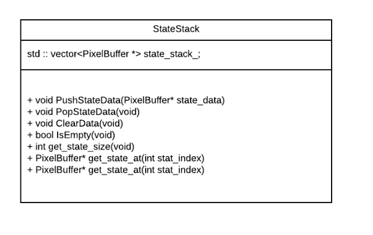

# Design Justifications for FlashPhoto
#### Group Name:  
CSCI3081W Group C04

#### Members:
- Shimao Hu   huxxx952
- Mingya Ma   maxxx950
- Zhouman Wu  wuxx0687
- Zixiang Ma  maxxx580


## 1  Design Question One
> This iteration of the project introduces the concept of filters. You had to implement several filters, which fell into two types: pixel-independent (where each pixel is filtered independently), and convolution-based (where filtering a pixel requires information about its neighboring pixels by means of a kernel). Naturally, a key design decision is how these filters are represented. Each filter has a different algorithm for modifying the canvas, and only some of these algorithms require kernels.
> First, in the **Design Description** section below, describe the design you developed to address this challenge. We expect that you will include at least one figure showing the relationships of the classes affected by your design. Second, in the **Design Justification** section below present the most compelling argument you can for why this design is justified.  Note that our expectation is that you will need to discuss the pros (and maybe cons) of your final design as compared to alternative designs that you discussed in your group in order to make a strong case for justifying your design.

### 1.1 Design Description Of Filters

##### 1.1.1 Filter
The filter module is designed to have two generalized classes: filter and kernel.The filter class is shown below and it contains common attributes such as apply_filter_to_photo method, It is inherited by nine specific type of filters including blur, motion blur, sharpen, edge detection, saturation, threshold, channel, quantize and a special filter. Filters can be categorized into two types: convolution-based filters and pixel independent filters.   

   
Figure 1. filter module class diagram

Convolution-based filter has a Kernel object, which is used to collect information from adjacent pixel. Pixel-independent filter contains attributes such as threshold or saturation, and operations are performed on each pixel individual based on those attributes.

Filter class definitions:
```
class Filter {
 public:
  Filter(void);
  ~Filter(void);
  virtual void set_color_data(ColorData * pixel);
  virtual void apply_filter_to_photo(PixelBuffer * display_buffer);

protected:
  Kernel matrix;
};
```
Filter class implementation:
```
namespace image_tools {

/*******************************************************************************
 * Constructors/Destructors
 ******************************************************************************/
Filter::Filter(void) {}
Filter::~Filter(void) {}
/*******************************************************************************
 * Member Functions
 ******************************************************************************/

void Filter::set_color_data(ColorData * pixel) {}

void Filter::apply_filter_to_photo(PixelBuffer * display_buffer){
  for (int row = 0; row < display_buffer->width(); row++) {
    for (int col = 0; col < display_buffer->height(); col++) {
      ColorData current_color = display_buffer->get_pixel(row, col);
      set_color_data(&current_color);
      display_buffer->set_pixel(row, col, current_color);
    }
  }
}
}  /* namespace image_tools */
```
##### 1.1.2 Kernel
Kernel class is inherited by four types of specific implementation (blur, motion blur, sharpen, and edge detection). All specific kernel shares a float array, a factor and size, but all of them overwrite the matrix initializer they inherits from kernel class. Kernel is associated and possessed by filters. Based on different filter types' implementation, only convolution-based filter will construct and use kernel.

Kernel definitions:
```
class Kernel {
 public:
  Kernel();
  explicit Kernel(float amount);
  ~Kernel(void);

  float const * float_array(void) const { return kernel_array_; }
  virtual void GenerateKernel(void);
  void set_array(int x, int y, float val);
  float get_array(int x, int y);

  virtual void set_factor(int size);
  float get_factor(void);
  void set_size(int s);
  int get_size(void);
 protected:

  float * kernel_array_;
  float factor;
  int size;
};
```
Kernel implementations:
```
namespace image_tools {
/*******************************************************************************
 * Constructors/Destructors
 ******************************************************************************/
Kernel::Kernel(float amount) {}
Kernel::Kernel() {}
Kernel::~Kernel(void) {}

/*******************************************************************************
  * Member functions
******************************************************************************/
float Kernel::get_factor() {
  return factor;
}

int Kernel::get_size() {
  return size;
}

void Kernel::set_size(int s) {
  size = s;
  return;
}

void Kernel::set_array(int x, int y, float val) {
  kernel_array_[x * size + y] = val;
  return;
}

float Kernel::get_array(int x, int y) {
	return kernel_array_[x * size + y];
}

void Kernel::GenerateKernel(void) {}
void set_factor(int size) {}

}   /* namespace image_tools */
```

### 1.2 Design Justification Of Filters

##### 1.2.1 Filter Design
Similar to the kernel class, the filter is constructed in a manner that most common behavior and attributes are generalized into abstract super class filter. Pixel-independent filter inherit and use apply_filter_to_photo method to launch. Convolution-based filter inherit a different method apply_conv_filter_to_photo in order to accommodate a offset of its kernel size. Each individual filter overwrite the set_color_data method to generate its own effects.

   
Figure.2 Alternative Design Approach for Filter Module   

There is one alternative design approach (see figure 2), where filter is extended into ConvolutionFilter and IndependentFilter. The ConvolutionFilter and IndependentFilter will be further extended into nine different filters. One benefits of this appoach is to maximize extent of abstraction, but at the same time it increases the design complexity and make its implementation more error-prone.

##### 1.2.2 Kernel Design
One of the major benefits of our design to abstract most behavior and attributes from specific object and generalize them into an abstract class. For example, all kinds of kernel behave identically to possess a matrix, set size, get size and get factor. However, kernel behaves differently on matrix initialization and factor calculation. The following snip of code shows the different implementation of kernel initialization of blur and sharpen kernel. Therefore, each specific kernel will overwrite these behavior in its implementation.

Kernel Initialization of Blur:
~~~
void BlurKernel::GenerateKernel(void) {
  int size = size;
  kernel_array_ = new float[size * size];
  int left = size / 2;
  int right = size / 2;
  for (int row = 0; row < size; row += 1) {
    for (int col = 0; col < size; col += 1) {
    // upper half
      if (row <= size / 2) {
          if (col >= left && col <= right) {
           set_array(row, col, 1);
        } else {
            set_array(row, col, 0);
        }
    // lower half
    } else {
        if (col >= left && col <= right) {
            set_array(row, col, 1);
        } else {
            set_array(row, col, 0);
           }
        }
    }
    if (row < size/2) {
        left -= 1;
        right += 1;
    } else if (row > size/2) {
        left += 1;
        right -= 1;
    }
  }
}
~~~

Kernel Initialization of Sharpen:
~~~
void SharpenKernel::GenerateKernel(void) {
    kernel_array_ = new float[size*size];
    for (int row = 0; row < size; row += 1) {
        for (int col = 0; col < size; col += 1) {
            if (row == size/2 && col == size/2) {
                set_array(row, col, size*size);
            }    else {
                set_array(row, col, -1);
            }
        }
    }
    return;
}
~~~

## 2  Design Question Two
> First, in the **Design Description** section below, describe the design you developed to address this challenge. Second, in the **Design Justification** section below present the most compelling argument you can for why this design is justified.  Note that our expectation is that you will need to discuss the pros (and maybe cons) of your final design as compared to alternative designs that you discussed in your group in order to make a strong case for justifying your design.

### 2.1 Design Description Of Undo/Redo
In our second important design, we will focus on our implementation of the Undo/Redo features in this project. There are actually variety of data structures available to implement these features. In our design, we chose two stacks to implement these functionalities since stack follows the principle of last-in-first-out(LIFO), it is efficient to reverse to any modification to the canvas as well as optionally re-applied.
#### 2.1.1 StateStack
In our design, the StateStack module is designed to implement the stack data structure to accomplish the undo/redo action. Two vectors are implemented as two stacks: the Undo stack and the Redo stack. The Undo stack is used to store the pixel buffer which last operation is applied to when the Undo button on the user interface is clicked. The Redo stack is used to store the pixel buffer which was most recently removed from the canvas by the undo operation.
The basic idea of undo/redo is quite straight forward. When the Undo button is clicked, the first pixel buffer in the Undo stack will be popped by PopStateData() and the current canvas will be updated to this popped pixel buffer. Meanwhile, this popped pixel buffer will be pushed into the redo stack by PushStateDate(). When the Redo button is clicked, the top pixel buffer stored in the Redo stack will be popped out and the current canvas will be updated to this pixel buffer. Also, Redo can only perform if the last operation applied to the canvas was an Undo. The Redo is invalid if extra actions have taken place between the Undo and Redo. In this case, all pixel buffer stored in the redo stack will be handled and cleaned by ClearData(void) function. The StateStack class is shown below.



Figure 1. StateStack module class diagram

StateStack class definitions:
```
class StateStack {
 public:
  StateStack();
  ~StateStack() {}

  void PushStateData(PixelBuffer* state_data);

  void PopStateData(void);

  void ClearData(void);

  bool IsEmpty(void);

  int get_state_size(void);

  PixelBuffer* get_state_at(int stat_index);

  void pop_first_state();

 private:
  /* data members */
  std :: vector<PixelBuffer *> state_stack_;
 };
}  /* namespace image_tools */

```
StateStack class implementation:
```
namespace image_tools {

/*******************************************************************************
 * Constructors/Destructor
 ******************************************************************************/
StateStack::StateStack(void) {}

/*******************************************************************************
 * Member Functions
 ******************************************************************************/

void StateStack::PushStateData(PixelBuffer* state_data) {
  this->state_stack_.push_back(state_data);
}

void StateStack::PopStateData(void) {
  this->state_stack_.pop_back();
}

int StateStack::get_state_size(void) {
  this->state_stack_.size();
}

PixelBuffer * StateStack::get_state_at(int stat_index) {
  return this -> state_stack_.at(stat_index);
}

void StateStack::pop_first_state() {
  this -> state_stack_.erase(state_stack_.begin());
}

void StateStack::ClearData(void) {
  for (int index = 0; index < state_stack_.size(); index ++) {
    delete state_stack_.at(index);
}

  this -> state_stack_.clear();
}

bool StateStack::IsEmpty(void) {
  return this -> state_stack_.empty();
}

}  /* namespace image_tools */
```
#### 2.1.2 StateManager
In the StateManager class, we designed a SaveState() function that is separated from both UndoOperation and RedoOperation. In the SaveState, it will first create a new PixelBuffer which is a copy of the current PixelBuffer. After checking the number of PixelBuffer stores in the Undo stack, this new PixelBuffer will be pushed to the Undo stack. Also, the SaveState() function handles the case that extra actions have taken place between the Undo and Redo. It will check whether the Redo Stack is not empty or not. If it is not empty, which is the invalid case, SaveState will clear all PixelBuffers store in redo stack by calling ClearData() function in StateStack class. The definition of StateManager class and the implementation of SaveState function is shown below.

StateManager class definition:
```
class StateManager {
 public:
  StateManager();
  ~StateManager() {}

  void InitGlui(const GLUI *const glui,
                void (*s_gluicallback)(int));

  void UndoOperation(
                  PixelBuffer** display_buffer,
                  StateStack* undo_buffers_stack,
                  StateStack* redo_buffers_stack);

  void RedoOperation(
                  PixelBuffer** display_buffer,
                  StateStack* undo_buffers_stack,
                  StateStack* redo_buffers_stack);

  void SaveState(
              PixelBuffer** display_buffer,
              StateStack* undo_buffers_stack,
              StateStack* redo_buffers_stack);

 private:
  void redo_toggle(bool select) {
    UICtrl::button_toggle(redo_btn_, select);
  }

  void undo_toggle(bool select) {
    UICtrl::button_toggle(undo_btn_, select);
  }

  /* Copy/move assignment/construction disallowed */
  StateManager(const StateManager &rhs) = delete;
  StateManager& operator=(const StateManager &rhs) = delete;

  /* data members */
  GLUI_Button *undo_btn_;
  GLUI_Button *redo_btn_;
};

}  /* namespace image_tools */
```

SaveState function implementation:
```
void StateManager::SaveState(
                            PixelBuffer **display_buffer,
                            StateStack *undo_buffers_stack,
                            StateStack *redo_buffers_stack) {
  PixelBuffer *copy_of_current_state = new PixelBuffer(
                                    (*display_buffer) -> width(),
                                    (*display_buffer) -> height(),
                                    (*display_buffer) -> background_color());

  PixelBuffer::BackUpPixelBuffer(copy_of_current_state, *display_buffer);

  if (undo_buffers_stack -> get_state_size() >= MAX_UNDO) {
    undo_buffers_stack -> pop_first_state();
  }

  undo_buffers_stack -> PushStateData(copy_of_current_state);

  while (!redo_buffers_stack -> IsEmpty()) {
    redo_buffers_stack -> ClearData();
  }

  if (!redo_buffers_stack -> IsEmpty()) {
    redo_toggle(true);
  } else {
    redo_toggle(false);
  }

  if (!undo_buffers_stack -> IsEmpty()) {
    undo_toggle(true);
  } else {
    undo_toggle(false);
  }
}
```
### 2.2 Design Justification of Undo/Redo
One alternative approach of implement the Undo/Redo features could be to implement a linked list instead of a stack. By using a doubly linked list, we can simply add nodes of the change states to the list as modifications are made to the canvas. Since it is a doubly linked list, we can traverse in both directions. To undo the current state, we just need to go back to the previous node in the linked list. To redo the changes made by undo, we can get the previous node in the opposite direction. While this solution has merit, it also has potential drawbacks: it requires to handle more pointers since we have to keep tracking and reassigning pointers while doing the undo/redo operations. Also, the insertion and deletion take more time because more pointer operations are required.
Compare to the design above, our solution using two stacks has two primary advantages: it encapsulates all low level functions to make the program less error-prone. Also, in our implementation, we set the limit of the PixelBuffers store in undo stack. If the undo stack reaches capacity, the first PixelBuffer(oldest) which has been stored in the stack will be removed by calling the pop_first_state() function in StateStack class.
```
void StateStack::pop_first_state() {
  this -> state_stack_.erase(state_stack_.begin());
}
```
So as long as there is memory, our undo/redo operations works efficiently and is ease of maintainability.

## 3  Design Question Three
> A new developer on your team must add a new filter to FlashPhoto. This filter is called  _Invert._ This filter performs the following conversion to all pixels in the canvas:
> ```
> newColor's red   = 1 - oldColor's red
> newColor's green = 1 - oldColor's green
> newColor's blue  = 1 - oldColor's blue
> ```
> Describe in the form of a tutorial (including code snippets) exactly what changes would need to be made to your program in order to fully integrate this new filter.

### Programming Tutorial: Adding a Filter

##### 1. <Step 1> Create new class called FilterInvert extending from Filter class.    
include/filter_invert.h
```
#include "include/filter"
class FilterInvert : public Filter {
  ....
}
```
##### 2. <Step 2> Create a new default and empty constructor for FilterInvert class.    
filter_invert.cc
```
FilterInvert::FilterInvert(void) {}
```
##### 3.  <Step 3> Overwrite set_color_data method. For each of the three colors, subtract its value from 1 and set new color.    
filter_invert.cc
```
void FilterInvert::set_color_data(ColorData * pixel) {
  pixel->red(1-pixel->red());
  pixel->blue(1-pixel->blue());
  pixel->green(1-pixel->green());
  return;
}
```
##### 4.  <Step 4> Use apply_filter_to_photo method, which is inherited from Filter class to apply its effects.
```
Filter * invert_filter = new FilterInvert();
invert_filter->apply_filter_to_photo(display_buffer);
```
the apply_filter_to_photo()function is inherited from filter class
<etc>
